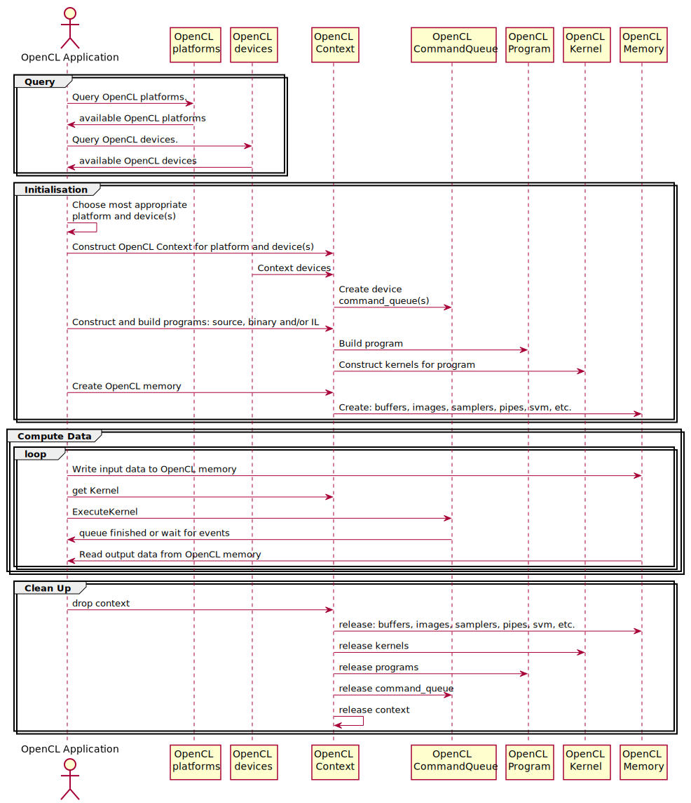
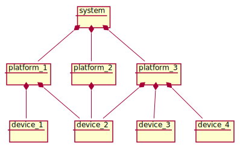
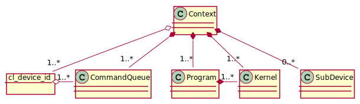
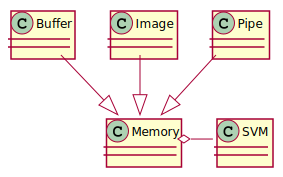

# OpenCL Description

**OpenCL** (Open Computing Language) is framework for parallel programming on
heterogeneous devices.
It is designed to harness the compute performance of GPUs, DSPs, FPGAs, etc.
to improve the throughput and latency of computationally intensive workloads.

## OpenCL Performance

A well designed OpenCL application running on appropriate hardware can
significantly outperform an equivalent application running on multiple CPUs.
However, a poorly designed OpenCL application or an OpenCL application
running on inappropriate hardware and/or with the wrong kind of data can be
*slower* than an equivalent application running on CPUs. There are several
performance overheads inherent to performing computational tasks off-board modern
CPUs to be considered before embarking on an OpenCL solution.

Parallel computing latency is governed by [Amdahl's law](https://en.wikipedia.org/wiki/Amdahl%27s_law), i.e. the minimum execution time of a parallelised process can
not be less than the parts of the process that *cannot* be parallelised.
Where OpenCL is concerned, the parts of the process that cannot be parallelised are:
* OpenCL Initialisation
* and data transfer between **host memory** and **device memory**.

Both OpenCL initialisation and data transfer can take longer than processing
the solution on modern CPUs, especially where the OpenCL programs/kernels to be
compiled are relatively large and/or using a compute device accessed via a
relatively slow mechanism, such as a [PCIe](https://en.wikipedia.org/wiki/PCI_Express)
bus to a discrete graphics card.

### Small Tasks

Modern multi-core CPUs can share cached data "on-chip" instead of transferring it
via shared memory let alone down a data-bus and application "kernels" (i.e. functions)
are compiled into an application, they do not need to be loaded and compiled again
before the application can run.

A well-designed parallel processing application using a [work-stealing](https://en.wikipedia.org/wiki/Work_stealing) task scheduler such as Intel's Threading
Building Blocks ([TBB](https://software.intel.com/content/www/us/en/develop/tools/oneapi/components/onetbb.html)) library often out-performs OpenCL applications for
"one off" tasks with a significant kernel compilation time and/or relatively
small data sets.

### CPU Devices

Note: the OpenCL data transfer overhead can be significantly reduced by using
a CPU device, since it can share the same memory (and maybe even the same cache)
as the OpenCL application's host. An OpenCL CPU device may provide the optimum
solution where the OpenCL kernels can utilise [SIMD](https://en.wikipedia.org/wiki/SIMD)
instructions on CPUs.

# OpenCL Lifecycle

Figure 1 shows the typical lifecycle of an OpenCL application.  
It can be considered as consisting of 4 phases:
* Query
* Initialisation
* Compute
* Clean-up

  
*Figure 1 OpenCL Application Lifecycle*

## Query

In the Query phase the OpenCL application queries the system tha it's running on
to determine what features it supports and which is (are) the best device(s) to
run on.

Where an OpenCL application is designed to run on specific hardware, this simply
involves discovering which OpenCL device(s) correspond to the required hardware.

However, where an OpenCL application is designed to run almost anywhere (like
the tests in this library) then it must query the available platforms and
devices to find the most appropriate platform and device(s).  

This is not a trivial task, since any system with a discrete graphics card is
likely to have more than one platform and each platform is likely to be connected
to more than one device. Furthermore, each device may be connected to more than one platform, see Figure 2.

  
*Figure 2 An Example OpenCL System*

The [OpenCL 3.0](https://www.khronos.org/registry/OpenCL/specs/3.0-unified/html/OpenCL_API.html) API specification has new queries to simplify this task.

## Initialisation

After the most suitable platform and device(s) have been found it is necessary
to create an OpenCL context for them.

### Context

An OpenCL application must have at least one context.
An OpenCL application may create more than one context but OpenCL does not support synchronisation between multiple contexts.

An OpenCL context can be created for more than one device, however the devices
must all be connected to the same platform. Where an OpenCL context has multiple
devices, OpenCL **does** provide synchronisation between the devices.

  
*Figure 3 Context Class Diagram*

The `opencl3` [Context](../src/context.rs#Context) manages OpenCL objects that
are required to compute data on OpenCL devices, i.e.:

* Command Queues
* Programs
* Kernels
* Sub Devices
* Memory

### Command Queue(s)

In order to execute OpenCL kernels on the context device(s), it is necessary to
create at least one command queue for each device. OpenCL permits more than
one command queue per device and also enables applications to split devices into
sub-devices, each of which require their own command queue(s).

### Programs and Kernels

Also, in order to execute OpenCL kernels, the program(s) in which they are
defined need to be created and built for all the devices in the context
before the kernels themselves can be constructed.

OpenCL programs can be built from source code, Intermediate Language
(IL, e.g [SPIR](https://www.khronos.org/spir/) or [SPIR-V](https://www.khronos.org/registry/spir-v/)) or binaries. Building from source or IL can take many seconds
for complex kernels, therefore it is tempting to load binary programs especially
if the application is designed to run on specific hardware.

Note: some devices have built-in kernels, e.g. [Intel Motion Estimation](https://software.intel.com/content/www/us/en/develop/articles/intro-to-advanced-motion-estimation-extension-for-opencl.html). These can also be
built into the context for the device(s) that have them.

`opencl3` creates all the OpenCL kernels in the programs managed by `Context`
and stores them in a HashMap in `Context` using the kernel name (in a `CString`)
as the key.

### Sub Devices

OpenCL devices can be partitioned into sub-devices, see [Partitioning a Device](https://www.khronos.org/registry/OpenCL/specs/3.0-unified/html/OpenCL_API.html#_partitioning_a_device). Unlike normal OpenCL devices that are connected
to a platform, sub-devices can be retained and released.
`opencl3` has a [SubDevice](../src/device.rs#SubDevice) struct to release
sub-devices when they are dropped.

As with normal OpenCL devices, each sub-device requires at least one
command queue to compute data on it.

Device partitioning is not supported by all OpenCL devices.
For more information see: [OpenCL Device Fission for CPU Performance](https://software.intel.com/content/www/us/en/develop/articles/opencl-device-fission-for-cpu-performance.html).

### Memory

Finally, the OpenCL kernels require memory from which to read input data and
write output data. Unless using host Shared Virtual Memory (SVM), the OpenCL
device memory (buffers, images and device SVM) must be created before data can be
transferred to and from the host to the OpenCL device memory, see Figure 4.

  
*Figure 4 An OpenCL Context's Memory Model*

OpenCL defines 4 different types of Memory Objects, see Figure 5:

* Buffer
* Image
* Pipe (*OpenCL 2*)
* Shared Virtual Memory (*OpenCL 2*)

  
*Figure 5 OpenCL Memory Objects*

The OpenCL API describes the Memory Objects in detail in the OpenCL [Memory Model](https://www.khronos.org/registry/OpenCL/specs/3.0-unified/html/OpenCL_API.html#_memory_model).

#### Sampler Objects

OpenCL also has Sampler Objects to specify how a kernel shall sample an image
when the image is read in the kernel, see [Sampler Objects](https://www.khronos.org/registry/OpenCL/specs/3.0-unified/html/OpenCL_API.html#_sampler_objects).

## Compute

Now that the OpenCL compute environment has been set up, data can be processed
by the OpenCL kernel(s) on the device(s).

The library stores OpenCL kernels by name in a HashMap in the Context struct.
An application can get OpenCL kernels it requires by name from the Context.

As shown in Figure 1, the application:
* writes input data from the Host Memory to the Global Memory shown in Figure 3;
* executes the kernel(s);
* reads output data from the Global Memory to the Host Memory shown in Figure 3;
* waits for the data read to finish.

### Data Transfer

An OpenCL 1.2 application (i.e. *without* SVM) performs all the tasks above via
a command_queue. OpenCL command queues have "enqueue" commands for: writing memory
buffers and images, executing kernels, and reading memory buffers and images.

An OpenCL 2.0 application with *coarse* SVM also performs all the tasks above via
a command_queue. However, instead of writing and reading memory to and from
context Global Memory, the application `maps` and `unmaps` the svm memory.

An OpenCL 2.0 application with *host* or *fine device* SVM does not need to
enqueue any commands to transfer data between Host Memory and Global Memory,
it either doesn't need it or it is handled by OpenCL "under the covers".

The OpenCL API describes [SVM data transfer](https://www.khronos.org/registry/OpenCL/specs/3.0-unified/html/OpenCL_API.html#shared-virtual-memory)
in more detail.

### Kernel Execution

Before a kernel can be "enqueued" on a command_queue, its arguments must be
initialised, i.e. the kernel function arguments must be set to the locations
of the input and output memory and any other data it may require.

After its arguments have been set, a kernel can be executed on a command queue
with the OpenCL `clEnqueueNDRangeKernel` function. This function controls *how*
kernels execute, see [Mapping work-items onto an NDRange](https://www.khronos.org/registry/OpenCL/specs/3.0-unified/html/OpenCL_API.html#_mapping_work_items_onto_an_ndrange).

This library contains an `ExecuteKernel` struct that implements the
[builder pattern](https://doc.rust-lang.org/1.0.0/style/ownership/builders.html)
to simplify setting up the arguments and `NDRange` when executing a kernel,
see: [kernel.rs](../src/kernel.rs).

### Events

All command_queue "enqueue_" commands can return an optional Event object and
take an event_wait_list as a parameter.

OpenCL events can be used to time how long OpenCL commands take to
execute by creating command queues with `CL_QUEUE_PROFILING_ENABLE` and
getting profile info from the events with `CL_PROFILING_COMMAND_START` and
`CL_PROFILING_COMMAND_END`.

OpenCL events can also be used to control "enqueue_" commands by supplying
events from previous "enqueue_" commands in the event_wait_list of the
command to be controlled.

Furthermore, if an OpenCL device supports out-of-order command execution and its
command queue was created with `CL_QUEUE_OUT_OF_ORDER_EXEC_MODE_ENABLE` then the
OpenCL events can be used to control out-of-order command execution, enabling
commands to run concurrently on the device. Together, the events and event_wait_lists
effectively create [directed acyclic graphs](https://en.wikipedia.org/wiki/Directed_acyclic_graph) to control execution on the device.

An application can wait for events to complete by calling `wait_for_events` with
an event_wait_list instead of calling `finish` on a command_queue.
`wait_for_events` enables an application to wait for events to complete
simultaneously on multiple queues, for example, see
[OpenCL events](http://people.cs.bris.ac.uk/~simonm/workshops/BSC_2013/opencl:course:bsc/Slides/OpenCL_events.pdf).

## Clean-up

A well-behaved OpenCL application should clean-up after itself by freeing memory
and releasing OpenCL objects, i.e.:
* events,
* samplers,
* images,
* buffers,
* pipes,
* svm,
* kernels,
* programs,
* command queues,
* and the context(s).

This library handles OpenCL clean-up automatically using [RAII](https://en.wikipedia.org/wiki/Resource_acquisition_is_initialization) by wrapping OpenCL objects in
structs that implement the [Drop trait](https://doc.rust-lang.org/book/ch15-03-drop.html).
